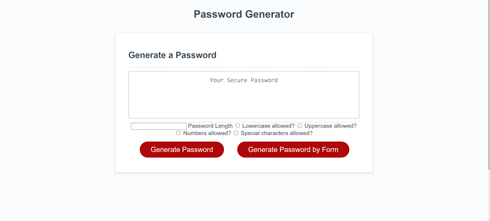
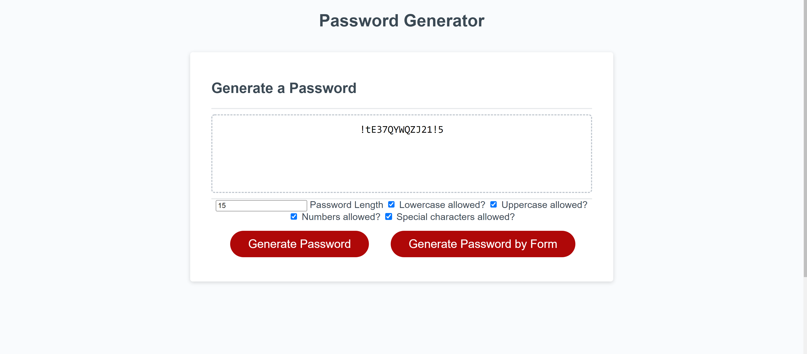
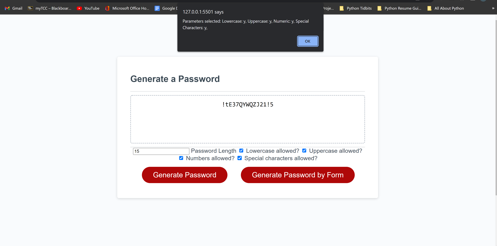

# Password-Generator

Author: Ehren Lewis

# About This Project

A random password generator built with javascript for the
logical side of the progamming.

This application creates a psuedorandom password between a given length, as well as 
based on 4 different parameters, lower case, upper case, numbers, and special characters. The user
can use all 4 if they choose, but they can also pick and choose which ones they would like.
They must have at least one parameter selected though, or the password will not generate.

I used only html css, and javascript for this project
.
Some of the challenges that I faced when building out the
logic of the program was firstly, form submission. It wasn't very intuitive
for me to get the hang of it. I had to do quite a bit of trial and error 
to learn how to submit the form, how to get the elements of a form, and then
the values and types of the elements. The other issues I had was using proper variable
definition. A lot of my variables had similar names that can be quite condusing to someone
looking from the outside.

Known issues: 
The biggest issue is that this is not secure password generator. This random
method of the math library is built off of a pseudo random number generator, which 
means that the generator is not truly random. 

There is an issue that if the user presses enter when trying to input values, the page completely refreshes.

I recommend do not use this for actual password, just in case if someone got ahold of the code
and could see when the random generator starts. The length and the parameters do help create a complex
password that is harder to crack, but I do not have any experience yet with cyber security and
truly random number generators, or cryptography,

# How to Install

1. Navigate to the code repository
2. Press the green code button, located near the about section
3. Copy either the HTTPS, Git CLI, download the zip, open with GitHub desktop, or copy the SSH link.
4. Depending on download method, use Git, executable, or the desktop application to open the content files
5. All of the content of the repository will be available after completion of the previous state.

# OR

1. Visit the live site
2. Copy the files from the developer tools into your own files

link to live site: https://github.com/Ehren-Lewis/Password-Generator
link to repository: https://ehren-lewis.github.io/Password-Generator/

# Usage

The user can use this project for generating passwor that are between the length
of 8 to 128 characters. They can also use the generator to choose the which
parameters they would like.

